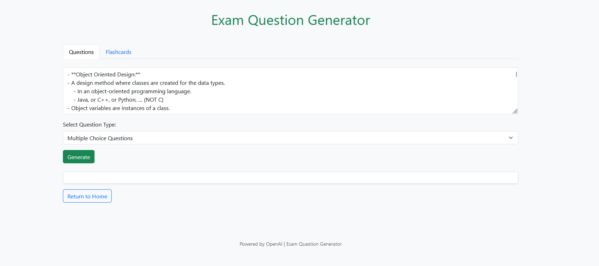
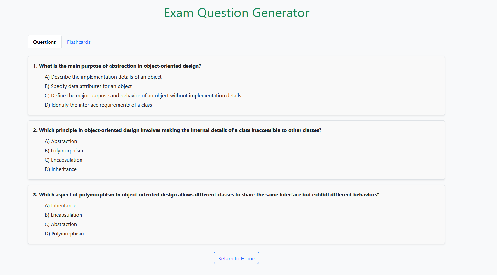
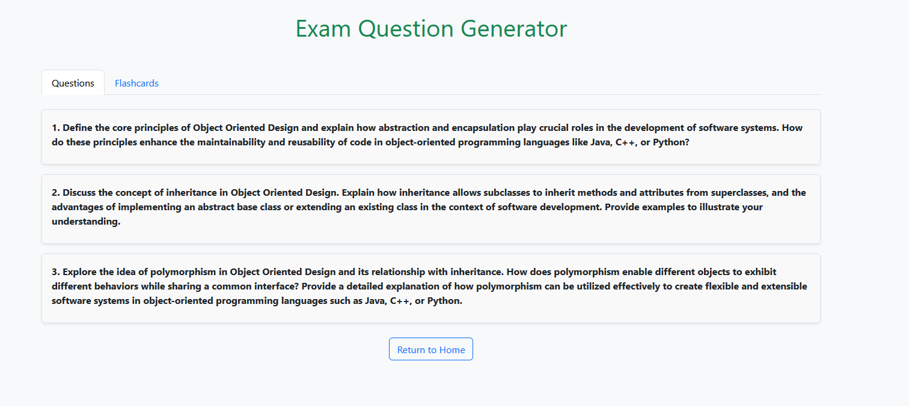
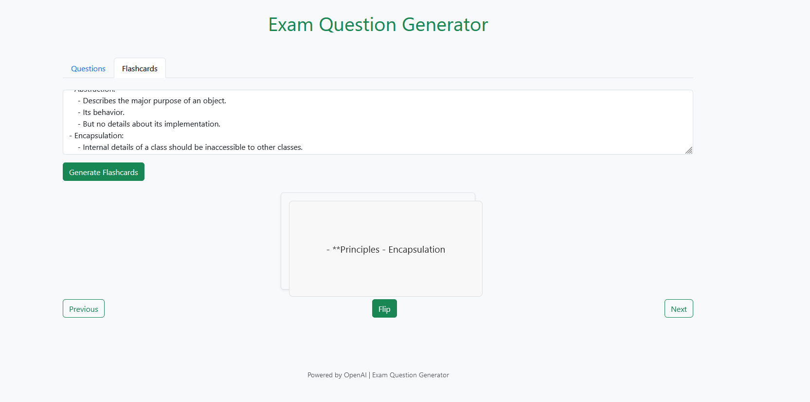
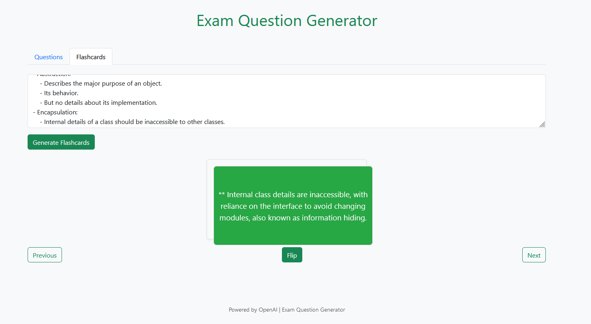

# ExamQBot

### **Overview**
The **Exam Question Generator** is a web application that leverages OpenAI's GPT models to generate educational content such as:
- Multiple Choice Questions (MCQs)
- Long Answer Questions
- Flashcards (Term and Definition format)

This tool is designed to help educators, students, and professionals quickly create learning materials based on custom input content.

---

## **Features**
- **Multiple Choice Questions**:
  - Generates multiple-choice questions with 4 answer options.
  - Displays questions in a clean, professional layout with separate boxes for each question.
- **Long Answer Questions**:
  - Generates in-depth, open-ended questions for detailed discussions.
- **Flashcards**:
  - Generates term-definition flashcards for quick learning.
  - Allows users to flip between terms and definitions interactively.

---

## **Technologies Used**
- **Frontend**:
  - HTML5, CSS3
  - Bootstrap 5 for responsive design.
  - JavaScript (inline within `index.html` for frontend functionality)

- **Backend**:
  - Python (Flask framework)
  - OpenAI GPT-3.5/4 API for question generation.
  - Dotenv for managing environment variables.

---

## **Setup Instructions**

### **1. Clone the Repository**
```bash
git clone https://github.com/ShafeiW/ExamQBot.git
cd question-generator
```

### **2. Create a Virtual Environment**
```bash
python -m venv venv
source venv/bin/activate  # On Windows: .\venv\Scripts\activate
```


### **3. Install Dependencies**
Manually install the required Python packages:
```bash
pip install flask python-dotenv openai
```

### **4. Set Up Environment Variables**
Create a .env file in the project root directory and add your OpenAI API key:
```bash
OPENAI_API_KEY=your-openai-api-key
```

### **5. Run the Application**
```bash
python app.py 
```

### **6. Navigate to local host: http://127.0.0.1:5000**


## **Usage**

### **1. Choose between question or flashcard generation.**

### **2. Enter content in the input boxes**
- preferably class notes without too many special characters.

### **3. If generating questions, select the question type:**
- Multiple Choice Questions (MCQs)
- Long Answer Questions

### **4. Click "generate" and view desired material.**


## **Project Structure**
```bash
question-generator/
│
├── app.py                 # Flask backend
├── templates/
│   └── index.html         # Frontend HTML
├── static/
│   └── styles.css         # Custom CSS for the app
├── .env                   # Environment variables 
└── README.md              # Project documentation
```

## **Future Enhancements**
- Add export functionality to download generated questions in PDF or Word format.
- Integrate user authentication to save and manage content.
- Add more customization options for generated questions (e.g., difficulty level, question count).

## **Screenshots**
### Main Interface


### Question Results



### Flashcard Results




